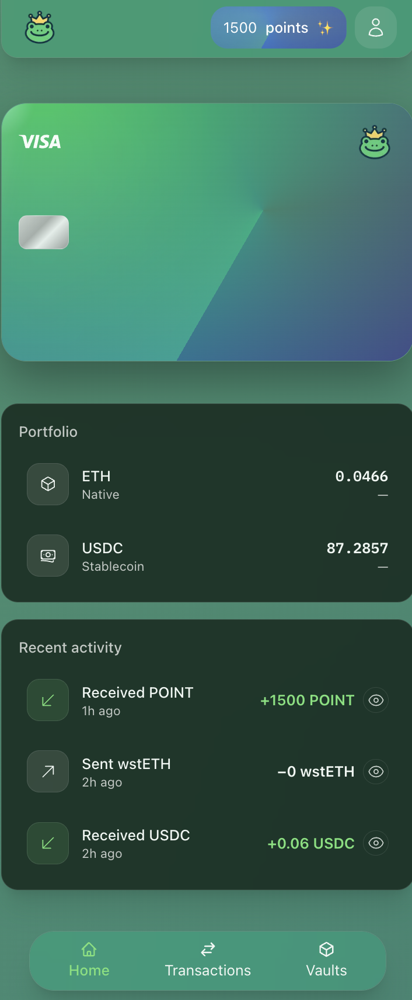
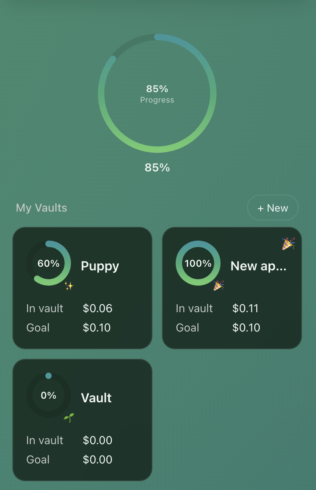
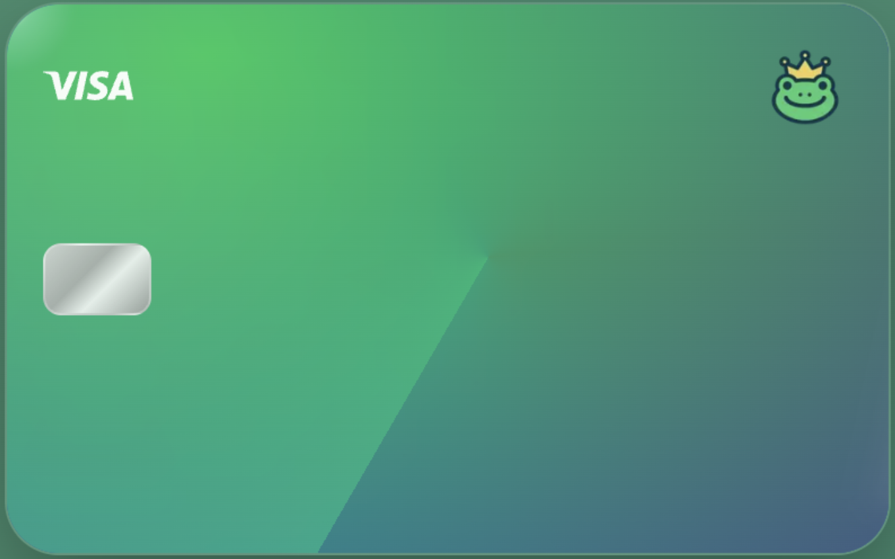

# Frog Pay hackathon submission details

With Frog Pay, users can pay with _anything_, _anywhere._ We issue a virtual card for everyone so they can spend their balance across any EVM chain. They can use it anywhere that accepts VISA! It was built over the weekend for [Aleph Hackathon](https://dorahacks.io/hackathon/aleph-hackathon/detail).

This doc is the hacathon submission stuff, which talks about how we qualify for the bounties we're applying for and things we want to continue to build in the Buildathon.

To learn exactly how Frog Pay works, including how we issue cards, how users pay, and how they can make more money in their savings accounts through using our Vaults feature - read the [README](./README.md). You can also follow along to learn how to run this app on your local machine.

## Lisk Founder Track

We solve a real problem - Frog Pay allows users to spend their crypto anywhere that accepts VISA without needing a bank account. These solutions already exist, but they are not self-custodial solutions, so users must still trust companies and underlying banks. Frog Pay is a self-custodial crypto card with the same features that people are used to in e-banking solutions.

Frog Pay will run a different business model than banks, as we do not have access to the user's balance. We do have access to tokens after they spend them, and we also split profits when the user uses our Vaults feature which automatically stakes and restakes.

This is a much safer solution than using the user's balance for risky investments. It combines the self-custodial trustless aspect of crypto with the ease of use of banks.

We would love to attend the Founder House in Buenos Aires. We plan to launch Frog Pay within the Argentinian regulatory sandbox and need all the legal and business help we can get! We are already in contact with VCs in LATAM.

## Symbiotic

In our Vaults feature, we allow users to stake and restake their assets into Symbiotic Vaults. We are using existing Vaults from Mellow - [the Lisk WSETH vault](https://app.mellow.finance/vaults/lisk-wsteth-vault) and the [Ethereum mainnet sUSDe vault](https://app.mellow.finance/vaults/ethereum-rsusde).

Our flow is quite complex as we want users to only deposit and withdraw ETH or USDC and be unaware of what is happening on the backend. So we have to use approved Routers for swapping within contracts, and then staking these swapped tokens, and using a Router to swap them before withdrawing.

You can find our ETH vault contract [here](./contracts/liskEth/SymbioticLiskEthVaultProxy.sol) and our USDC vault contract [here](./contracts/mainnetUsdc/SymbioticUSDCVaultProxy.sol).

We will keep building this in the Buildathon and plan to launch in the Argentina regulatory sandbox. After this weekend we plan to spin up a Symbiotic consumer network using the Relay SDK to attest cross-chain vault balances and secure our withdrawal router with stake sourced directly from our vaults. There is a huge network we can build and need to secure - we want to replace traditional banking networks.

## ENS

We focused on the **Financial access** area.

The reason we were inspired to build this is because Argentina (and LATAM as whole) has a huge adoption of crypto due to inflation and government distrust. However, it's still not easy to spend your crypto, especially if you do not have a bank account to onramp and offramp. There are some crypto card solutions, and they're awesome and used widely here in Argentina, but they are not self-custodial. You have to trust the company the same way that tradfi has to trust the bank.

To dive even deeper, there is an estimated 400k adults in LATAM who do not have access to a bank account - up to 60% in some countries. They cannot receive or send payments in things that are not cash, and are becoming increasinly more detached from the banked world.

Frog Pay is a solution for this, allowing users to pay with their crypto anywhere while still having full control of their assets.

Frog Pay also has a savings features called Vaults, which are used to automatically stake their tokens and restake into Symbiotic vaults. The user does not need to know anything about staking or staking pools and can simply deposit and withdraw USDC, even though in the background there are swaps & bridges happening to find safe staking contracts. They can share their Vaults with other users on Frog Pay who can contribute to their savings but can't withdraw. This can be used for things like crowfunding campaigns or even family emergency saving accounts. This allows users to make use of the collaborative nature of blockchain to save money in a safer, self-custodial way.

Our goal is to replace banks entirely. LATAM already has the onramping infrastructure so let's make payments easier. We believe we can bank the unbanked in a way that is actually useful, and better-bank the banked.

We have integrated ENS for showing points which you can find [here](./src/components/features/authed/home/PointsPage.tsx). We will also integrate ENS for sending payments to and from people with Frog Pay.

## V0 by Vercel

We're huge fans of Vercel and weren't going to use anything else! We used V0 to design the frontend components (although we wrote the logic ourselves). We're particularly happy with how the debit card component turned out. We also deployed both the Frog Pay and Zarpado Shop apps to our domain using Vercel. You can find Frog Pay [here](https://www.usefrogpay.com/) and Zarpado Shop [here](https://shop.usemonadpay.com/).

